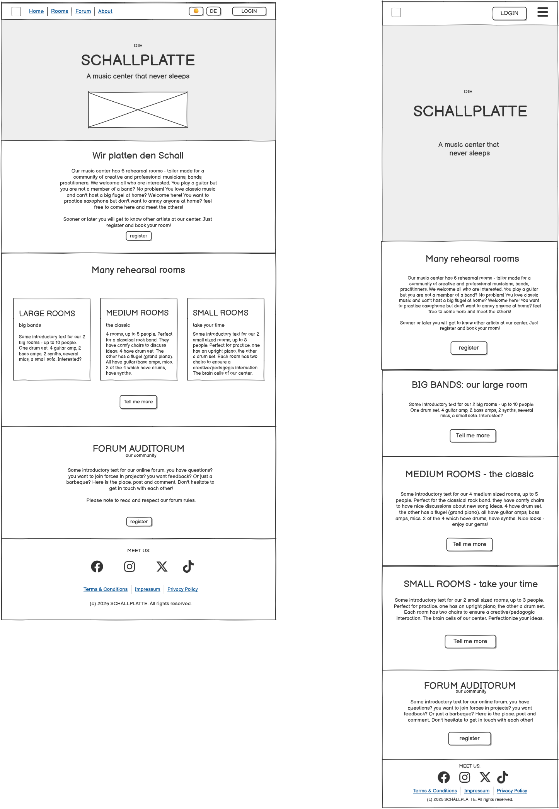
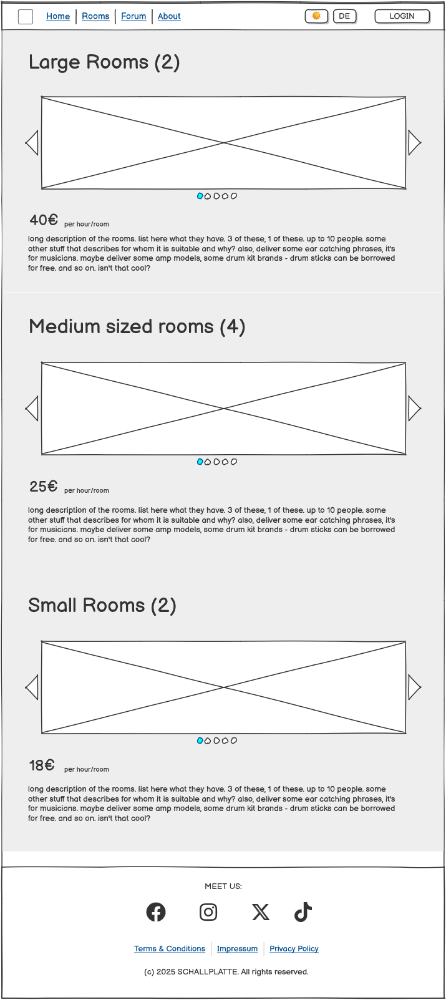
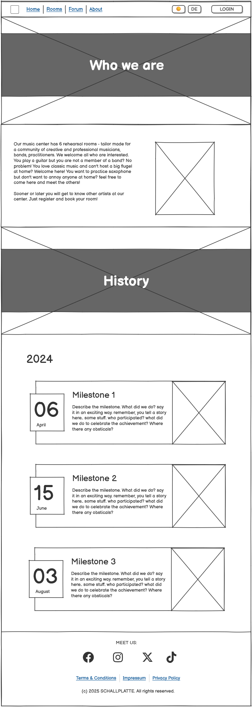
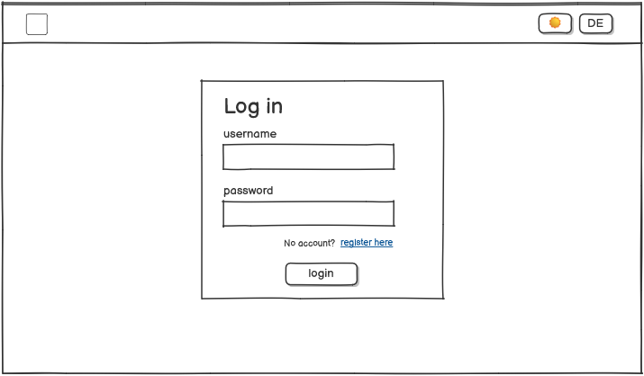
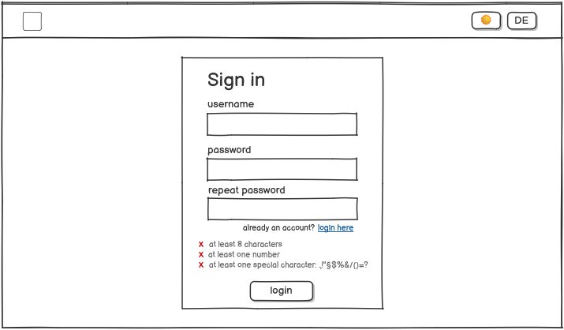
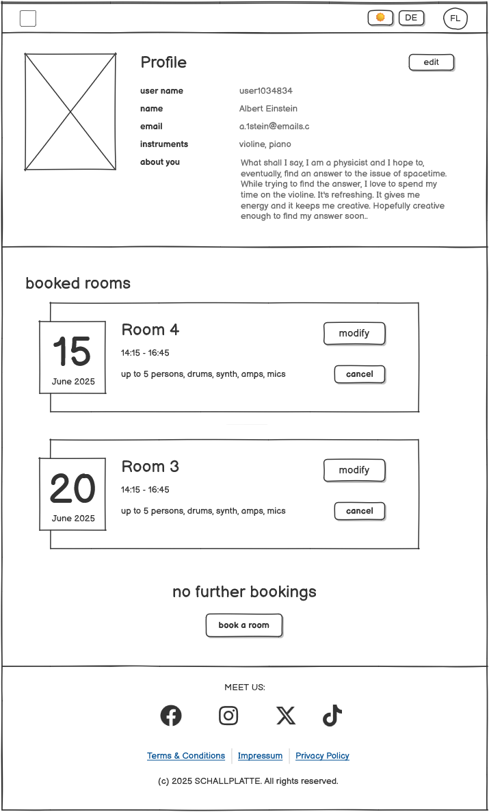
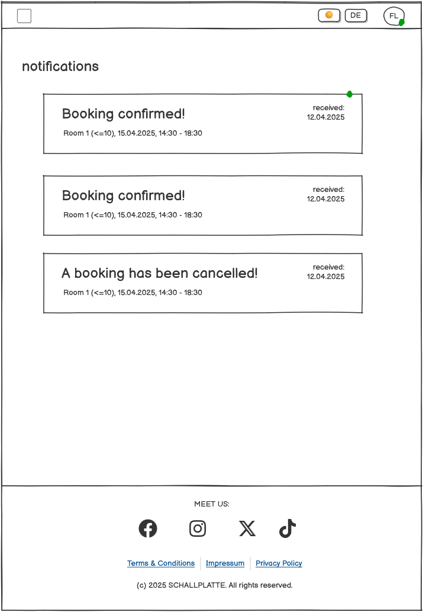
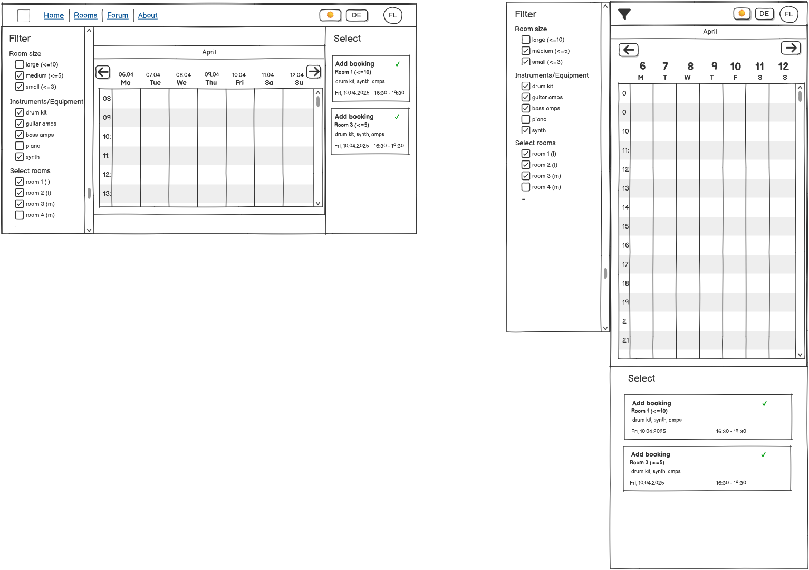

 # Die Schallplatte
 Developer: Felix Lehmann

 This project simulates a music center, called Schallplatte, which rents 9 rehearsal rooms to its members/musicians. It seeks to create and maintain a community for musicians, that's why an online forum has been announced for the near future. As hinted in the milestones (the about page), an own rock event/festival is planned. By now, the modern and minimalistic design of this website shall attract for young people. So, this project is solely done in a mobile-first principle. Moreover, an upcoming forum on this website is announced, which shows the vitality of this builing. For explanation: "Schallplatte" is the German word for a vinyl.

 **The challenges** in this project mostly appeared when working with the MVS/MVT. Django is a very powerful framework but I quite often didn't fully understand what I was doing. So, studying the MVT framework itself became the most time consuming part in the project. Eventually, I mastered extending the user model, as username and email was not enough for a music center that clearly wants to set up a social network. In contrast, building the object model for the calendar cursor was a great challenge.

 **Currently existing user account with multiple bookings**
 - U: w.heisenberg P: quantum2025 
 - U: e.schroedinger P: cats1935
 Of course you can also register and test it that way.

___

# Table of content

- [Site Owner Goals](#)
- [Target group](#)
   - [The musician](#)
   - [User stories](#)
- [Design](#)
     - [Mobile First and JS](#)
     - [Wireframes](#)
     - [Colors & Theme](#)
- [Technologies used](#)
- [Structure](#)
    - [Page structure and apps](#)
    - [Data models](#)
    - [Object models](#)
- [Features](#)
- [Validations](#)
- [Testings](#)
- [Bugs](#)
- [Heroku deployment](#)
- [credits](#)
   - [References](#)
   - [Media](#)
- [Acknowledgments](#)

# Site Owner Goals
The main goal is to attract as many site musicians as possible and convince them to rent the rehearsal rooms. For that, which can be seen as the second main goal, the visitors must register and become part of Schallplatte's community. 

# Target group
## The musician
**What is a typical musician**
Well, that is not at all easy to answer, but there are some points that can be narrowed down. Nearly all musicians, practitioners and composers want a room practice. When they are in their creative phase, they don't want to be disturbed. Also, the life of a creative mind can quickly become spontaneous. Finall, they look for other artists they can share ideas with or simply enjoy their passion.
- what if there would be a music center where members can book rehearsal rooms
- different rooms for different purposes to build up a community
- large rooms/medium rooms/small rooms
- for singers, bands, practicers, performers, professionals
- big band rooms with drums, several amps and synths
- medium rooms for hobby bands or professionals to practice their gigs
- small rooms for practicioners, single musicians, creative environments, projects etc

After these thoughts, the profile becomes clear. A music center that tackles the above issues, definitely benefits from a website that raises attention for this community.  

## User stories
Info: there is not intention of the order of the user stories
**As a first/general user**
- As a first user I can visit a forum page so that can get information about the latest news
- As a user I can switch between dark theme and light theme so that I can visit the page with more comfort
- As a first user I can register so that I'll be able to book rehearsal rooms
- As a first user I can see a brief presentation about the center on an about page so that I know with whom I am dealing with
- As a first user I can see pictures of the rehearsal rooms so that I can decide which room fits the best for my purpose
- As a first user I can visit the landing page so that I get to know what the music center "Schallplatte" is about

**As a member**
- As a member I can log in so that I can book rehearsal rooms
- As a member I can successfully book a rehearsal room so that I can enter it an practice music
- As a member I can modify existing bookings so that it fits into my personal time schedule.
- As a member I can cancel bookings so that I can free up time slots for others.
- As a member I can choose time slots in a calendar view so that so that I can see if rooms are available before I actually request the booking.
- As a member I can filter rooms in the booking process by size and containing instrument so that I can find suitable rooms more efficiently
- As a member I can log out from my profile so that others can't enter it (accidentally)
- As a member I can delete my profile so that I am not a member of the center anymore
- As a member I can view/edit my profile so that I have full control about my own data

**As an admin**
- As an admin I can delete/change/add (CRUD) bookings of others so that I rearrange the time schedule if it's necessary.
- 

# Design
## Mobile first & JS
Before we go into the details of the design, I want to highlight some project related principles about design. We target young creative artists, meaning that the website is mostly seen in a mobile view. As a consequence, all features should be designed with the mobile first approach, even if it is time consuming, especially features like a calendar tool were the user needs to see other booking items, too. 

Second, quick JS solutions for styles and designs/themes seems to be tempting. However, the maintanance in future becomes more difficult. So, the principle for this project is "No JS is better than good JS". Sooner or later, you will use JavaScript anyway for tricky and complicated cases - it will be difficult enough to maintain. The rest, that can be done outside of JS, should be done outside of it. In particular, using proper CSS selectors, using classes in html-tag as well as custom "data-[...]"-attributes. 

These two principles from above significantly improves User experience and stability. No cracking while scrolling, less risks of bugs etc.

## Wireframes
The page design can be put into 3 main categories. 

  

  core pages (like landing page, about, rooms presentation and forum announcement). Typical: hero sections, simplistic and centralized design.
  

  
  
  

  
user pages like login, register, profile edit, notifications. 

  
  
  
  

  
calendar tool for booking rooms. It's a one page "application" that fits all necessary features on one screen.

  

## Colors and Theme
Regarding the color paletts: I have two paletts. One for a dark theme, one for a light theme. One might wonder why I put effort into this. There are two reasons:
1. <strong>Global Custom Color variables in CSS </strong>it creates the need to declare the theme in the CSS selectors which allows me to completely ignore JS. The advantage: I can now, based on the theme (which is an attribute in the html), automatically choose between custom colors, if I create global root-variables in CSS (i saved the global color variables in a separate "themes.css"). I only need to import that CSS file to other css and i have the same colors everywhere
2. <strong>Use of "theme" attribute in the html to customize Bootstrap</strong> one might question this as a benefit, since it is quite some work to set up. Well, these special CSS selectors make the selections of higher priority than without. As an example: <code> html[theme="dark"] main</code> will overwrite <code> main</code>. Well, this is a great feature, because it means I can easily customize all bootstrap classes from now on. I don't have to go into the Bootstrap classes and adjust them there and I don't have to accept the re-occuring look of Bootstrap but I still benefit from the efficiency of developing features and components (like collapsing nav bars, drawers, proper models etc.). And all that without the use of JS and <code> !important </code>

# Technologies used
- html
- CSS
- Django/python
- postgresql
- Heroku
- Bootstrap 5.3
- Fontawesome 5
- GitHub
- Git
- Visual Studio Code
- Google Chrome dev tools
- Greenshot
- Balsamiq

# Structure
## Page structure and apps
- 

## Data Models
## Object Model

# Features

# Validations

# Testings

# Bugs

# Heroku deployment

# Credits
## References
## Media

# Acknowledgement