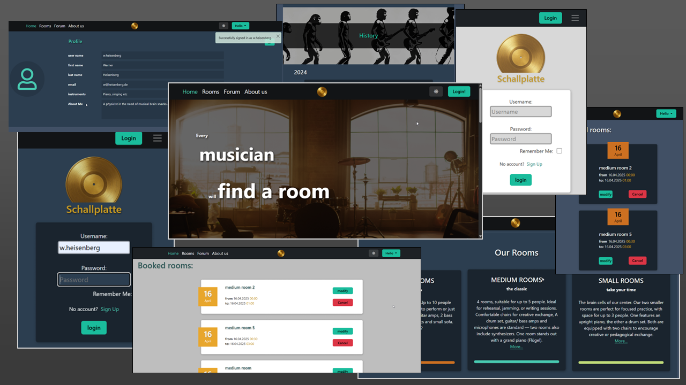

 # Die Schallplatte
 Developer: Felix Lehmann

 This project simulates a music center which rents 9 rehearsal rooms to its members/musicians. This center seeks build up a community. However, there is clearly a business case behind, where the rooms (and sometimes) music isntruments are rent. With the modern and minimalistic design this website seeks to be attractive for young people. So, this project is solely done in a mobile-first principle. Moreover, an upcoming forum on this website is announced, which shows the vitality of this builing. 

 **The challenges** in this project mostly appeared when working with the MVS/MVT. Django is a very powerful framework but I quite often faced the challenge to not fully understand what I was doing. One of the major challenges were extending the user model and handing them in to the same form in template

 **Currently existing user account with multiple bookings**
 - U: w.heisenberg P: quantum2025 
 - U: e.schroedinger P: cats1935
 Of course you can also register and test it that way.

___

# Table of content

1. [Site Owner Goals](#user-experience)
1. [Target group](#target-audience)
   2. [The musician](#user-expectations)
   3. [User stories](#user-stories)
1. [Design](#first-time-user)
      2. [Mobile First and JS](#returning-user)
      3. [Wireframes](#wireframes)
      5. [Colors and thems](#design)
      1. [Fonts](#font)
      2. [Structure](#structure)

2. [Technologies used](#technologies-used)
   1. [Languages](#languages)
   2. [Frameworks & tools](#frameworks-and-tools)
3. [Features](#features)
   1. [Existing features](#existing-features)
   2. [Upcoming features](#upcoming-features)
4. [Testing](#testing)
   1. [Validator testing](#validator-testing)
      1. [HTML](#html)
      2. [CSS](#css)
      3. [Performance](#performance)
      4. [Responsiveness](#responsiveness)
      5. [Accessability](#accessability)
  2. [Fixed bugs](#fixed-bugs)
  3. [Unfixed bugs](#unfixed-bugs)
  4. [User Story testing](#user-story-testing)
5. [Deployment](#deployment)
6. [Credits](#credits)
   1. [Content](#content)
   2. [Media](#media)
